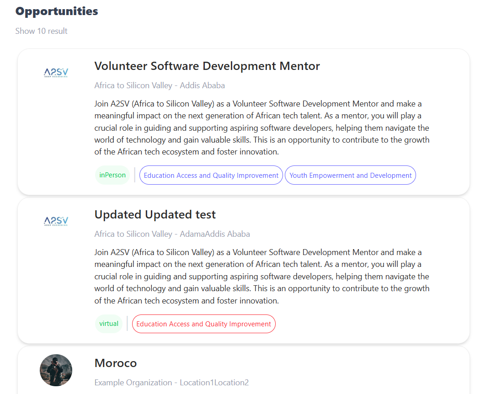
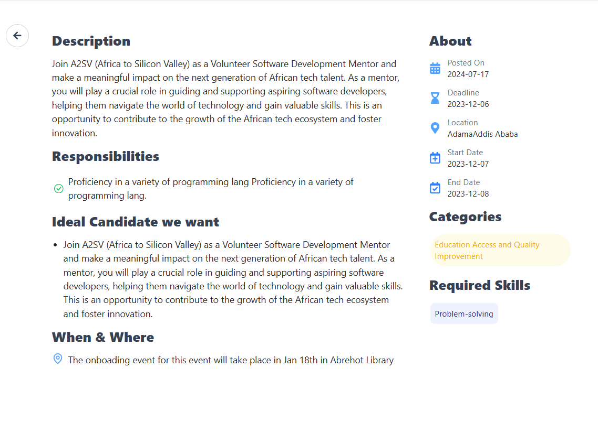

# Job Listing Application

## Project Description

This application displays a list of job opportunities in card format. Clicking on a job shows its detailed description on a separate page. The layout and UI were built using Tailwind CSS and React, with data sourced from a JSON file.

## Features

- Displays a list of job postings in a card layout
- Clicking a job card navigates to a detailed job page
- A "Back to Home" button is included on the detail page
- Responsive design using Tailwind CSS
- Static JSON used for data population

## UI Preview:

### Job Listing Page



### Job Detail Page



## Getting Started

### Installation

```bash
npm install
npm run dev
```
